# Documento de Requisitos

## Histórico de Revisões Deste Arquivo

| Data       | Versão | Descrição                | Autor  |
| ---------- | ------ | ------------------------ | ------ |
| 08/09/2025 | 1.0    | Versão inicial           | João Pedro, Enzo Garcia |
| 15/09/2025 | 1.1    | Foi atualizado o documento de requisito implementando todos os índices | João Pedro, Enzo Garcia |

## 1. Introdução

### 1.1 Propósito

Esse documento tem como propósito auxiliar no entendimento dos requisitos funcionais e não funcionais; funcionalidades e restrições do sistema; caracteristicas dos usuários e a descrição dos metodos utilizados na priorização dos requisitos.

### 1.2 Escopo

O projeto tem como finalidade intermediar doações de equipamentos para os alunos de baixa renda que estudam na Fatec Garça, por meio de doadores, sejam eles empresas ou pessoas físicas/jurídicas. O site irá conter uma pagina de login onde a pessoa/empresa será identificada de acordo com o metodo de login utilizado, uma pagina de doação sendo visível a todos os usuarios, uma pagina de requerimento de doação visível somente ao aluno fatec Garça, pagina de gestão das doações que será visível somente ao usuario administrador.

### 1.3 Definições, Acrônimos e Abreviações

[Lista de termos, definições, acrônimos e abreviações utilizados no documento]

## 2. Descrição Geral

### 2.1 Perspectiva do Produto

O produto é um sistema que será desenvolvido em uma plataforma web, onde os doadores poderão se cadastrar, onde será preciso validar os documentos para evitar tentativas fraudulentas, desse modo sendo possível fazer os cadastros das peças para doação, e os candidatos a receber as doações precisarão comprovar renda familiar.

### 2.2 Funcionalidades do Produto

Funcionalidades do produto: 
    Visualização das doações (podendo ser feito sem estar logado)
    Pagina institucional onde terá informações gerais do projeto, como ele funciona e regras de participação
    Cadastro e Autenticação de doadores
    Validação de Documentos
    Cadastro de itens para doação
    Gerenciamento de doação
    Comprovação de renda
    Solicitação de doação
    Acompanhamento da doação
    Gestão de usuarios
    Geração de relatórios
    

### 2.3 Características dos Usuários

O publico alvo é divido em 2 tipos, sendo eles:

Doadores que podem ser pessoas físicas, jurídicas ou empresas. O único requisito é que tenham idade mínima de 18 anos. Não existem outras restrições específicas quanto ao perfil do doador.

Beneficiários são os alunos que obrigatoriamente serão estudantes da FATEC Garça. Além disso, devem comprovar sua renda para que possam ser elegíveis a receber as doações.

### 2.4 Restrições

O sistema irá obedecer restrições legais e tecnicas, sendo elas a LGPD (Lei geral da proteção de dados) que visa assegurar a privacidade e proteção de dados dos usuários, sendo os dados armazenados de forma criptografada; será feito a validação dos documentos de doadores e beneficiários, afim de evitar praticas fraudulentas; somente alunos da Fatec - Garça poderão ser aptos a receberem doações; e o sistema seguirá restrições tecnicas, sendo seu desenvolvimento feito como uma aplicação web responsível, e o backend da aplica aplicação será implementado utilizando Java com Api Restful e a persistencia de dados via JPA, enquanto o frontend utilizará HTML, CSS e JavaScript.

## 3. Requisitos Específicos
### 3.1 Requisitos Funcionais

| RF01 |O sistema deve permitir o cadastro de um doador                                         | [Alta]  |
| RF02 |O sistema deve permitir que o doador cadastre algum componente  para doação.            | [Alta]  |
| RF03 |O sistema deve permitir que o aluno solicite algum equipamento                          | [Alta]  |
| RF04 |O sistema deve permitir que o aluno veja os equipamentos que estão na lista de doação   | [Média] |
| RF05 |O sistema deve ter uma opção de recuperação de senha para que o aluno resgate sua conta | [Media] |
 
### 3.2 Requisitos Não Funcionais
| RNF01 | Usabilidade       | A interface do sistema deve ser intuitiva                                                   | [Alta]  |
| RNF02 | Performance       | As páginas do sistema deverão ser carregadas rapidamente, evitando lentidoes                | [Média] |
| RNF03 | Segurança         |A senha dos usuários devem ser armazenadas de forma criptografada                            | [Média] |
| RNF04 | Compatibilidade   |O sistema deve ser compatível com quaisquer tipo de navegador                                | [Média] |
| RNF05 | Privacidade       | O tratamento de dados pessoais deverão estar em vigor com a lei Geral da Proteção de Dados  | [Alta]  |

## 4. Visão Geral do Sistema

O projeto é dividido em 3 camadas, o frontend que é a área voltada para o cliente , sendo sua interface, o backend, onde será desenvolvido todo o sistema, banco de dados, onde serão armazenados as informações de todos os usuários. A plataforma poderá ser acessada por até 3 tipos de usuários, sendo eles o doador, o aluno e o administrador. Cada um vai interagir com o sistema de acordo com suas permissões.

## 5. Casos de Uso

```mermaid
flowchart TB

    Usuario([Usuário])
    Doador([Doador])
    Aluno([Aluno])
    Funcionario([Funcionário])

    Usuario -->|herda| Doador
    Usuario -->|herda| Aluno
    Usuario -->|herda| Funcionario

    subgraph Sistema["Sistema de Doação e Recondicionamento"]
        CU1["Criar conta de doador"]
        CU2["Oferecer doação"]
        CU3["Ver o que já doou"]
        CU4["Avisar que recebeu o equipamento"]
        CU5["Criar conta de aluno"]
        CU6["Mudar senha"]
        CU7["Entrar no sistema"]
        CU8["Pedir equipamento"]
        CU9["Acompanhar pedido"]
        CU10["Preparar e destinar equipamentos"]
        CU11["Acessar Painel Administrativo"]
        CU12["Gerenciar doações recebidas"]
        CU13["Gerenciar cadastros de alunos"]
        CU14["Montar novo equipamento"]
        CU15["Designar equipamento para aluno da fila"]
        CU16["Atualizar status de equipamento"]
        CU17["Registrar doação recebida"]
        CU18["Avaliar e testar componentes doados"]
    end

    Doador --> CU1
    Doador --> CU2
    Doador --> CU3

    Aluno --> CU4
    Aluno --> CU5
    Aluno --> CU6
    Aluno --> CU7
    Aluno --> CU8
    Aluno --> CU9

    Funcionario --> CU10
    Funcionario --> CU11
    Funcionario --> CU12
    Funcionario --> CU13

    CU10 --> CU14
    CU10 --> CU15
    CU10 --> CU16

    CU12 --> CU17
    CU12 --> CU18
```

## 6. Priorização de Requisitos

O método utilizado no projeto foi a Classificação por Níveis de Prioridade. Os requisitos funcionais e não funcionais foram analisados e categorizados em três níveis (alta, média e baixa), com base em sua importância para a implementação do projeto.

## 7. Aprovação

| Nome   | Papel   | Assinatura | Data       |
| ------ | ------- | ---------- | ---------- |
| [Nome] | [Papel] |            | DD/MM/AAAA |
| [Nome] | [Papel] |            | DD/MM/AAAA |

>[!NOTE]
>Este documento será atualizado incrementalmente ao longo do desenvolvimento do projeto.
