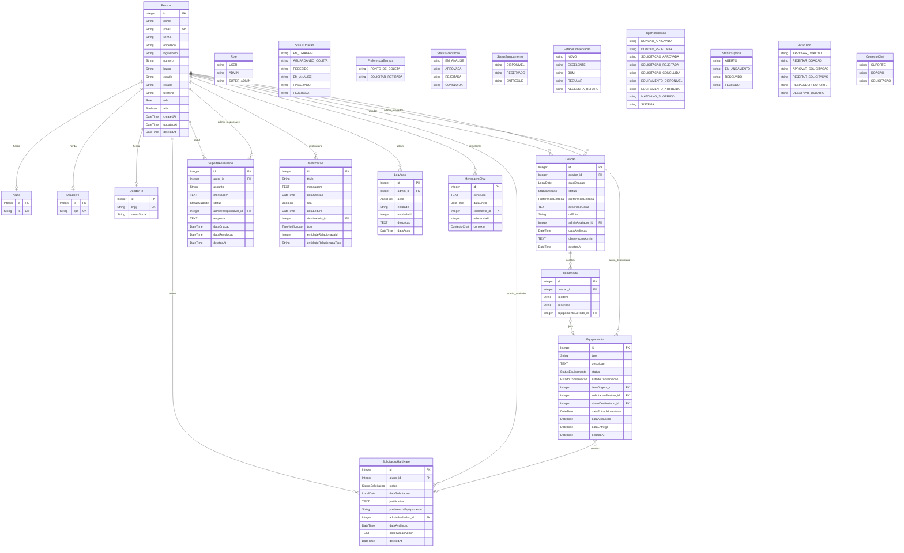

# Diagrama de Entidades — DoaTec

```mermaid
erDiagram

    %% ===================== ACCOUNT =====================

    Pessoa {
        Integer id PK
        String nome
        String email UK
        String senha
        String endereco
        String logradouro
        String numero
        String bairro
        String cidade
        String estado
        String telefone
        Role role
        Boolean ativo
        DateTime createdAt
        DateTime updatedAt
        DateTime deletedAt
    }

    Aluno {
        Integer id FK
        String ra UK
    }

    DoadorPF {
        Integer id FK
        String cpf UK
    }

    DoadorPJ {
        Integer id FK
        String cnpj UK
        String razaoSocial
    }

    Pessoa ||--o| Aluno : "herda"
    Pessoa ||--o| DoadorPF : "herda"
    Pessoa ||--o| DoadorPJ : "herda"

    %% ===================== DONATION =====================

    Doacao {
        Integer id PK
        Integer doador_id FK
        LocalDate dataDoacao
        StatusDoacao status
        PreferenciaEntrega preferenciaEntrega
        TEXT descricaoGeral
        String urlFoto
        Integer adminAvaliador_id FK
        DateTime dataAvaliacao
        TEXT observacaoAdmin
        DateTime deletedAt
    }

    ItemDoado {
        Integer id PK
        Integer doacao_id FK
        String tipoItem
        String descricao
        Integer equipamentoGerado_id FK
    }

    Pessoa ||--o{ Doacao : "doador"
    Pessoa ||--o{ Doacao : "admin_avaliador"
    Doacao ||--o{ ItemDoado : "contém"

    %% ===================== SOLICITACAO =====================

    SolicitacaoHardware {
        Integer id PK
        Integer aluno_id FK
        StatusSolicitacao status
        LocalDate dataSolicitacao
        TEXT justificativa
        String preferenciaEquipamento
        Integer adminAvaliador_id FK
        DateTime dataAvaliacao
        TEXT observacaoAdmin
        DateTime deletedAt
    }

    Pessoa ||--o{ SolicitacaoHardware : "aluno"
    Pessoa ||--o{ SolicitacaoHardware : "admin_avaliador"

    %% ===================== INVENTORY =====================

    Equipamento {
        Integer id PK
        String tipo
        TEXT descricao
        StatusEquipamento status
        EstadoConservacao estadoConservacao
        Integer itemOrigem_id FK
        Integer solicitacaoDestino_id FK
        Integer alunoDestinatario_id FK
        DateTime dataEntradaInventario
        DateTime dataAtribuicao
        DateTime dataEntrega
        DateTime deletedAt
    }

    ItemDoado |o--o| Equipamento : "gera"
    Equipamento }o--o| SolicitacaoHardware : "destino"
    Pessoa ||--o{ Equipamento : "aluno_destinatario"

    %% ===================== SUPPORT =====================

    SuporteFormulario {
        Integer id PK
        Integer autor_id FK
        String assunto
        TEXT mensagem
        StatusSuporte status
        Integer adminResponsavel_id FK
        TEXT resposta
        DateTime dataCriacao
        DateTime dataResolucao
        DateTime deletedAt
    }

    Pessoa ||--o{ SuporteFormulario : "autor"
    Pessoa ||--o{ SuporteFormulario : "admin_responsavel"

    %% ===================== NOTIFICATION =====================

    Notificacao {
        Integer id PK
        String titulo
        TEXT mensagem
        DateTime dataCriacao
        Boolean lida
        DateTime dataLeitura
        Integer destinatario_id FK
        TipoNotificacao tipo
        Integer entidadeRelacionadaId
        String entidadeRelacionadaTipo
    }

    Pessoa ||--o{ Notificacao : "destinatario"

    %% ===================== AUDIT =====================

    LogAcao {
        Integer id PK
        Integer admin_id FK
        AcaoTipo acao
        String entidade
        Integer entidadeId
        TEXT descricao
        DateTime dataAcao
    }

    Pessoa ||--o{ LogAcao : "admin"

    %% ===================== CHAT =====================

    MensagemChat {
        Integer id PK
        TEXT conteudo
        DateTime dataEnvio
        Integer remetente_id FK
        Integer referenciaId
        ContextoChat contexto
    }

    Pessoa ||--o{ MensagemChat : "remetente"

    %% ===================== ENUMS =====================

    Role {
        string USER
        string ADMIN
        string SUPER_ADMIN
    }

    StatusDoacao {
        string EM_TRIAGEM
        string AGUARDANDO_COLETA
        string RECEBIDO
        string EM_ANALISE
        string FINALIZADO
        string REJEITADA
    }

    PreferenciaEntrega {
        string PONTO_DE_COLETA
        string SOLICITAR_RETIRADA
    }

    StatusSolicitacao {
        string EM_ANALISE
        string APROVADA
        string REJEITADA
        string CONCLUIDA
    }

    StatusEquipamento {
        string DISPONIVEL
        string RESERVADO
        string ENTREGUE
    }

    EstadoConservacao {
        string NOVO
        string EXCELENTE
        string BOM
        string REGULAR
        string NECESSITA_REPARO
    }

    TipoNotificacao {
        string DOACAO_APROVADA
        string DOACAO_REJEITADA
        string SOLICITACAO_APROVADA
        string SOLICITACAO_REJEITADA
        string SOLICITACAO_CONCLUIDA
        string EQUIPAMENTO_DISPONIVEL
        string EQUIPAMENTO_ATRIBUIDO
        string MATCHING_SUGERIDO
        string SISTEMA
    }

    StatusSuporte {
        string ABERTO
        string EM_ANDAMENTO
        string RESOLVIDO
        string FECHADO
    }

    AcaoTipo {
        string APROVAR_DOACAO
        string REJEITAR_DOACAO
        string APROVAR_SOLICITACAO
        string REJEITAR_SOLICITACAO
        string RESPONDER_SUPORTE
        string DESATIVAR_USUARIO
    }

    ContextoChat {
        string SUPORTE
        string DOACAO
        string SOLICITACAO
    }
```
