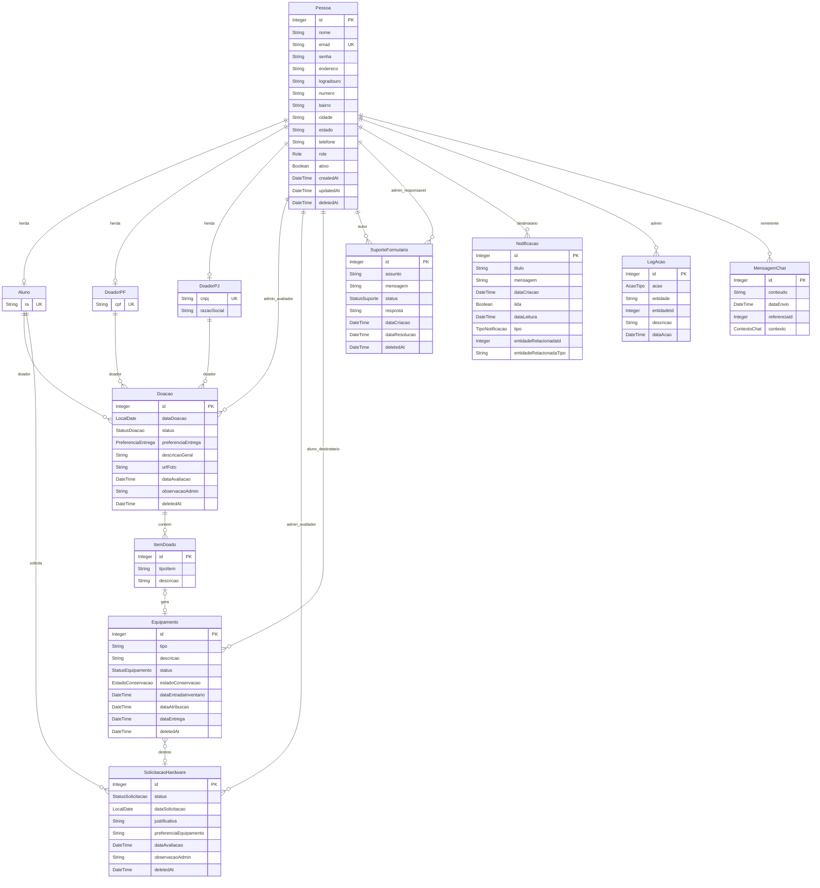

# Diagrama de Entidades — DoaTec

```mermaid
erDiagram

    Pessoa {
        Integer id PK
        String nome
        String email UK
        String senha
        String endereco
        String logradouro
        String numero
        String bairro
        String cidade
        String estado
        String telefone
        Role role
        Boolean ativo
        DateTime createdAt
        DateTime updatedAt
        DateTime deletedAt
    }

    Aluno {
        String ra UK
    }

    DoadorPF {
        String cpf UK
    }

    DoadorPJ {
        String cnpj UK
        String razaoSocial
    }

    Pessoa ||--o| Aluno : "herda"
    Pessoa ||--o| DoadorPF : "herda"
    Pessoa ||--o| DoadorPJ : "herda"

    Doacao {
        Integer id PK
        LocalDate dataDoacao
        StatusDoacao status
        PreferenciaEntrega preferenciaEntrega
        String descricaoGeral
        String urlFoto
        DateTime dataAvaliacao
        String observacaoAdmin
        DateTime deletedAt
    }

    ItemDoado {
        Integer id PK
        String tipoItem
        String descricao
    }

    DoadorPF ||--o{ Doacao : "doador"
    DoadorPJ ||--o{ Doacao : "doador"
    Aluno ||--o{ Doacao : "doador"
    Pessoa ||--o{ Doacao : "admin_avaliador"
    Doacao ||--o{ ItemDoado : "contem"

    SolicitacaoHardware {
        Integer id PK
        StatusSolicitacao status
        LocalDate dataSolicitacao
        String justificativa
        String preferenciaEquipamento
        DateTime dataAvaliacao
        String observacaoAdmin
        DateTime deletedAt
    }

    Aluno ||--o{ SolicitacaoHardware : "solicita"
    Pessoa ||--o{ SolicitacaoHardware : "admin_avaliador"

    Equipamento {
        Integer id PK
        String tipo
        String descricao
        StatusEquipamento status
        EstadoConservacao estadoConservacao
        DateTime dataEntradaInventario
        DateTime dataAtribuicao
        DateTime dataEntrega
        DateTime deletedAt
    }

    ItemDoado |o--o| Equipamento : "gera"
    Equipamento }o--o| SolicitacaoHardware : "destino"
    Pessoa ||--o{ Equipamento : "aluno_destinatario"

    SuporteFormulario {
        Integer id PK
        String assunto
        String mensagem
        StatusSuporte status
        String resposta
        DateTime dataCriacao
        DateTime dataResolucao
        DateTime deletedAt
    }

    Pessoa ||--o{ SuporteFormulario : "autor"
    Pessoa ||--o{ SuporteFormulario : "admin_responsavel"

    Notificacao {
        Integer id PK
        String titulo
        String mensagem
        DateTime dataCriacao
        Boolean lida
        DateTime dataLeitura
        TipoNotificacao tipo
        Integer entidadeRelacionadaId
        String entidadeRelacionadaTipo
    }

    Pessoa ||--o{ Notificacao : "destinatario"

    LogAcao {
        Integer id PK
        AcaoTipo acao
        String entidade
        Integer entidadeId
        String descricao
        DateTime dataAcao
    }

    Pessoa ||--o{ LogAcao : "admin"

    MensagemChat {
        Integer id PK
        String conteudo
        DateTime dataEnvio
        Integer referenciaId
        ContextoChat contexto
    }

    Pessoa ||--o{ MensagemChat : "remetente"
```
