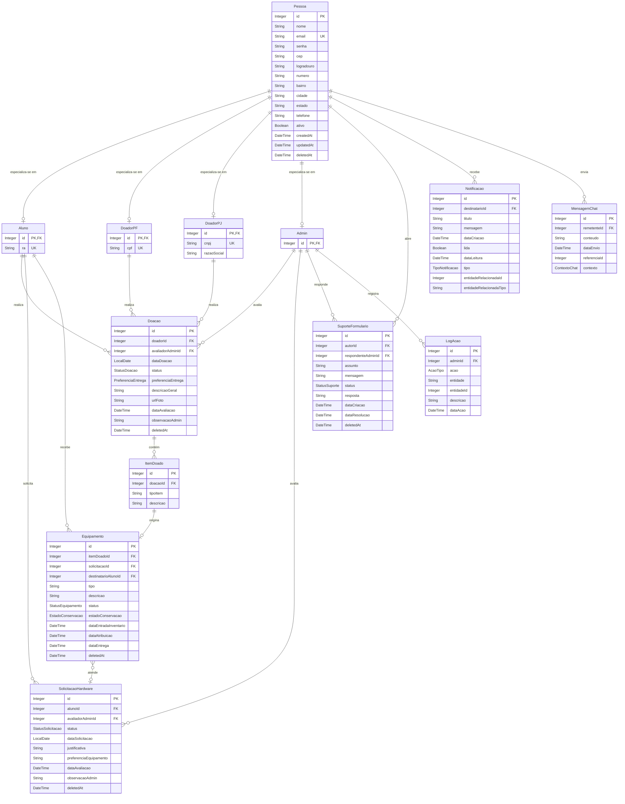

# Diagrama de Entidades — DoaTec

> Modelo de dados do sistema DoaTec: cadastro de pessoas (com herança), fluxo de doações de hardware, controle de inventário, solicitações de alunos, suporte, notificações e auditoria.

## Sumário

- [Visão geral](#visão-geral)
- [Convenções](#convenções)
- [Diagrama ER](#diagrama-er)
- [Módulos](#módulos)
- [Enums](#enums)

---

## Visão geral

O sistema é organizado em sete módulos:

| Módulo | Entidades | Propósito |
|--------|-----------|-----------|
| **Pessoa** | `Pessoa`, `Aluno`, `DoadorPF`, `DoadorPJ`, `Admin` | Cadastro unificado com herança *JOINED* |
| **Doação** | `Doacao`, `ItemDoado` | Registro e avaliação de doações |
| **Solicitação** | `SolicitacaoHardware` | Pedidos de equipamento por alunos |
| **Inventário** | `Equipamento` | Controle de equipamentos doados e destinados |
| **Suporte** | `SuporteFormulario` | Canal de atendimento |
| **Notificação** | `Notificacao` | Mensagens internas aos usuários |
| **Auditoria** | `LogAcao` | Histórico de ações administrativas |
| **Chat** | `MensagemChat` | Mensagens contextuais entre usuários |

## Convenções

- **PK** — chave primária
- **FK** — chave estrangeira
- **UK** — chave única (*unique*)
- **Cardinalidades Mermaid**:
  - `||--o{` — um para zero-ou-muitos
  - `||--o|` — um para zero-ou-um (usado em herança JOINED)
  - `}o--o|` — zero-ou-muitos para zero-ou-um
- **Soft delete** — entidades com `deletedAt` suportam exclusão lógica.

## Diagrama ER

## Módulos

### Pessoa (herança JOINED)
`Pessoa` é a superclasse com dados comuns (identificação, contato, endereço, auditoria). Cada subclasse (`Aluno`, `DoadorPF`, `DoadorPJ`, `Admin`) vive em sua própria tabela e compartilha o `id` com `Pessoa` como **PK + FK**. Uma pessoa pode ser, no máximo, **uma** das especializações por vez.

### Doação
Uma `Doacao` é criada por qualquer tipo de doador (`Aluno`, `DoadorPF` ou `DoadorPJ`), avaliada por um `Admin` e composta por um ou mais `ItemDoado`. A polimorfia do doador é representada por três relacionamentos (`Aluno`/`DoadorPF`/`DoadorPJ` → `Doacao`), dos quais apenas um é preenchido por registro.

### Solicitação
`SolicitacaoHardware` é aberta exclusivamente por `Aluno` e passa por avaliação de `Admin`. O resultado pode gerar a destinação de um `Equipamento`.

### Inventário
`Equipamento` representa cada unidade física do inventário. Cada equipamento **origina-se** de um `ItemDoado`, pode estar **destinado** a uma `SolicitacaoHardware` aprovada e, ao ser entregue, vincula-se a um `Aluno` destinatário.

### Suporte
`SuporteFormulario` é aberto por qualquer `Pessoa` (independente do tipo) e respondido por um `Admin`.

### Notificação
`Notificacao` registra mensagens internas enviadas a uma `Pessoa`. Os campos `entidadeRelacionadaId` / `entidadeRelacionadaTipo` permitem referência polimórfica ao recurso de origem (doação, solicitação etc.).

### Auditoria
`LogAcao` mantém histórico imutável de ações executadas por administradores.

### Chat
`MensagemChat` armazena mensagens trocadas em diferentes contextos (ver enum `ContextoChat`), com `referenciaId` ligando ao recurso relacionado.

## Enums

| Enum | Valores típicos |
|------|-----------------|
| `StatusDoacao` | `PENDENTE`, `APROVADA`, `REJEITADA`, `RECEBIDA` |
| `PreferenciaEntrega` | `RETIRADA`, `ENTREGA_NO_LOCAL` |
| `StatusSolicitacao` | `PENDENTE`, `APROVADA`, `REJEITADA`, `ATENDIDA` |
| `StatusEquipamento` | `DISPONIVEL`, `RESERVADO`, `ENTREGUE`, `DESCARTADO` |
| `EstadoConservacao` | `NOVO`, `BOM`, `REGULAR`, `RUIM` |
| `StatusSuporte` | `ABERTO`, `EM_ANALISE`, `RESPONDIDO`, `FECHADO` |
| `TipoNotificacao` | `DOACAO`, `SOLICITACAO`, `EQUIPAMENTO`, `SUPORTE`, `SISTEMA` |
| `AcaoTipo` | `CRIAR`, `ATUALIZAR`, `EXCLUIR`, `APROVAR`, `REJEITAR` |
| `ContextoChat` | `DOACAO`, `SOLICITACAO`, `SUPORTE` |

> Os valores acima são uma referência sugerida — confirme com a implementação real das enums no código-fonte.
